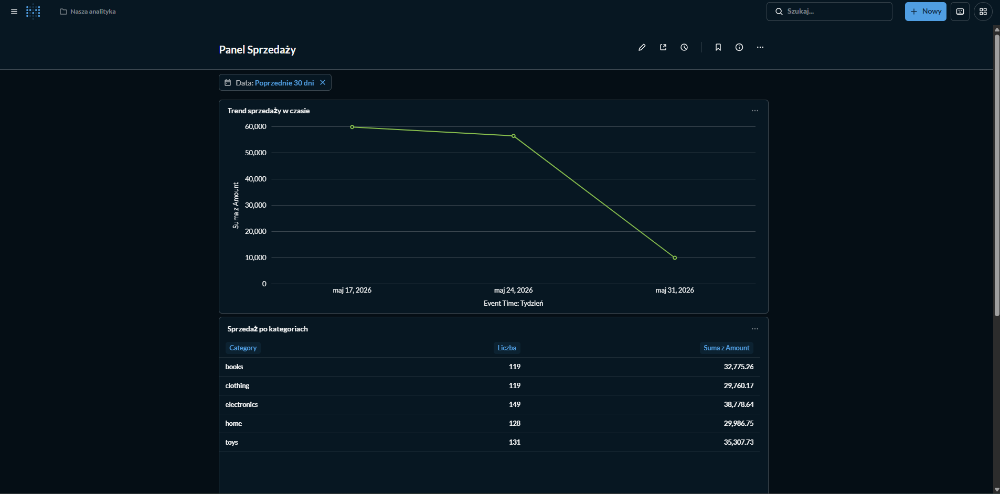
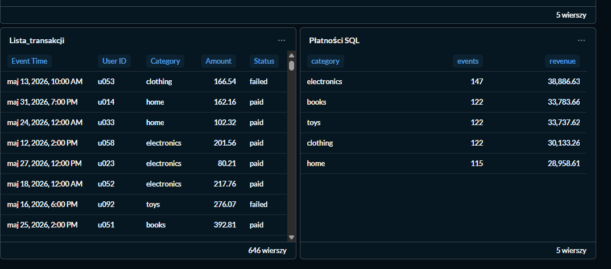

# Laboratorium 12 - Business Intelligence w narzędziu Metabase

---

## Cel ćwiczenia

Celem laboratorium było praktyczne poznanie podstaw Business Intelligence, czyli sposobu analizowania danych i przedstawiania ich w czytelnej formie. W ramach ćwiczenia uruchomiono bazę danych PostgreSQL, podłączono do niej narzędzie Metabase oraz przygotowano interaktywny dashboard z wykresami i tabelami.

## Zadanie 1 i 2: Przygotowanie środowiska i załadowanie danych

Środowisko zostało uruchomione za pomocą `docker-compose`. Dzięki temu można było łatwo uruchomić dwa kontenery:

1. `postgres:16` – baza danych, w której przechowywane były dane do analizy.
2. `metabase/metabase:latest` – aplikacja Metabase, czyli narzędzie do tworzenia analiz i dashboardów.

Dane zostały wygenerowane i załadowane do bazy za pomocą skryptu w Pythonie. Wykorzystano do tego biblioteki `pandas` oraz `sqlalchemy`. Następnie Metabase zostało połączone z bazą PostgreSQL przez sieć Dockera. Jako host bazy wskazano `postgres`, ponieważ tak nazywał się kontener z bazą danych.

## Zadanie 3: Analiza wizualizacji i pytania

W Metabase utworzono cztery pytania, które pokazują dane w różnych formach:

1. **Tabela utworzona przez GUI**
   Tabela dobrze nadaje się do podglądu surowych danych. Można dzięki niej sprawdzić pojedyncze rekordy i zobaczyć, jak wyglądają dane w bazie.

2. **Wykres słupkowy**
   Wykres słupkowy jest przydatny do porównywania wartości między kategoriami. Dzięki niemu można szybko zobaczyć, która kategoria przynosi największy przychód.

3. **Tabela SQL**
   W tym przypadku użyto własnego zapytania SQL. Pozwoliło ono policzyć liczbę zdarzeń oraz sumę przychodów. Jest to bardziej zaawansowany sposób analizy danych.

4. **Wykres liniowy**
   Wykres liniowy najlepiej sprawdza się przy analizie zmian w czasie. Pozwala zobaczyć, jak sprzedaż zmieniała się w kolejnych tygodniach oraz w których momentach pojawiły się większe wzrosty.

## Zadanie 4: Interaktywny dashboard

W ramach zadania przygotowano dashboard w Metabase. Najważniejsze wykresy i podsumowania zostały umieszczone na górze, a bardziej szczegółowe tabele na dole. Dzięki temu pulpit jest czytelny i łatwo można zacząć analizę od najważniejszych informacji.

Dodano również globalny filtr zakresu dat. Filtr został połączony z kartami znajdującymi się na dashboardzie, dlatego po zmianie dat automatycznie aktualizują się wszystkie wykresy i tabele. Pozwala to analizować dane dla wybranego okresu.

**Zrzut ekranu gotowego pulpitu:**

## Zadanie 5: Zagadnienia teoretyczne i wskaźniki KPI

Jako główny wskaźnik biznesowy KPI wybrano **sumę przychodów**. Jest to prosty i ważny wskaźnik, ponieważ pokazuje, jaką wartość sprzedaży uzyskano w danym okresie. Na wykresie liniowym można było sprawdzić, jak przychody zmieniały się w kolejnych tygodniach.

### Różnice pojęciowe i architektoniczne

**Przetwarzanie danych a warstwa BI**

Przetwarzanie danych polega na ich przygotowaniu, na przykład czyszczeniu, zmianie formatu, łączeniu tabel albo wykonywaniu obliczeń. Takie rzeczy można robić na przykład w Pythonie albo Apache Spark.

Warstwa BI, czyli w tym przypadku Metabase, służy głównie do prezentowania gotowych danych. Metabase nie służy do zaawansowanego przetwarzania danych, tylko do tworzenia wykresów, tabel, dashboardów i filtrów, które pomagają lepiej zrozumieć dane.

**Dashboard a raport statyczny**

Raport statyczny, na przykład plik PDF, pokazuje dane z jednego konkretnego momentu. Nie można go łatwo filtrować ani zmieniać bez przygotowania nowej wersji raportu.

Dashboard jest bardziej elastyczny. Można na nim zmieniać filtry, wybierać zakres dat i od razu obserwować zmiany na wykresach. Dzięki temu dashboard jest wygodniejszy do bieżącej analizy danych.

**Zapytanie ad-hoc a KPI**

Zapytanie ad-hoc to jednorazowe pytanie do danych. Można je wykonać, gdy chcemy szybko sprawdzić konkretną rzecz, na przykład sprzedaż w wybranym dniu.

KPI to stały wskaźnik, który jest regularnie obserwowany. Przykładem KPI może być suma przychodów, liczba zamówień albo średnia wartość sprzedaży. Takie wskaźniki często umieszcza się na dashboardach, ponieważ pomagają ocenić sytuację firmy.

### Porównanie Metabase z Apache Superset

**Metabase** jest prostsze i bardziej przyjazne dla użytkownika. Łatwo można w nim tworzyć podstawowe wykresy, tabele i dashboardy bez bardzo dobrej znajomości SQL. Dobrze sprawdza się w mniejszych projektach oraz tam, gdzie użytkownicy chcą szybko analizować dane.

**Apache Superset** jest bardziej rozbudowanym narzędziem. Oferuje więcej możliwości i lepiej nadaje się do większych środowisk oraz bardziej zaawansowanych analiz. Wymaga jednak większej wiedzy technicznej, szczególnie z zakresu SQL i pracy z dużymi zbiorami danych.

## Wnioski

Podczas laboratorium udało się uruchomić środowisko BI z wykorzystaniem PostgreSQL i Metabase. Dane zostały poprawnie załadowane do bazy, a następnie przedstawione w formie tabel i wykresów. Przygotowany dashboard pozwala szybko analizować sprzedaż oraz korzystać z filtrów dat. Ćwiczenie pokazało, że narzędzia BI są bardzo przydatne do prezentowania danych w czytelnej i interaktywnej formie.
